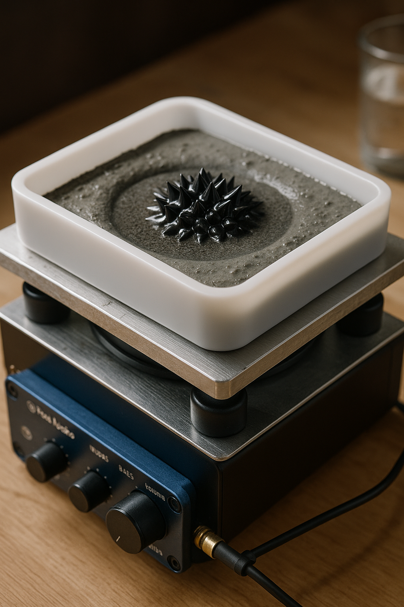
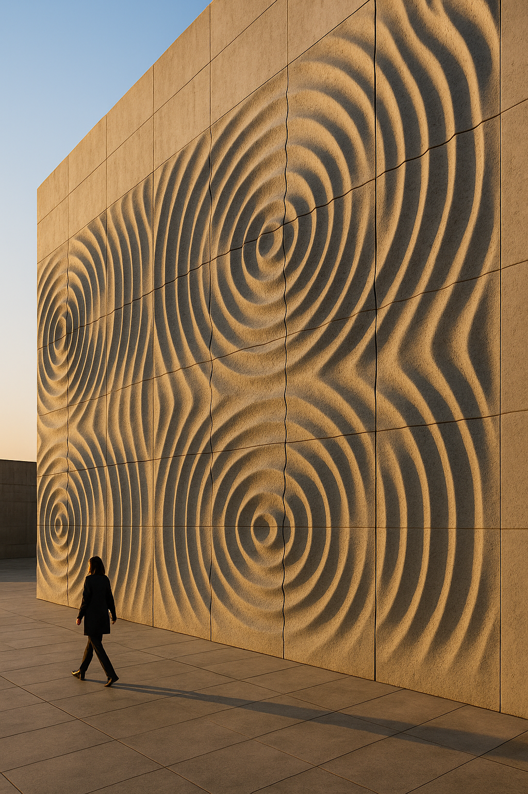
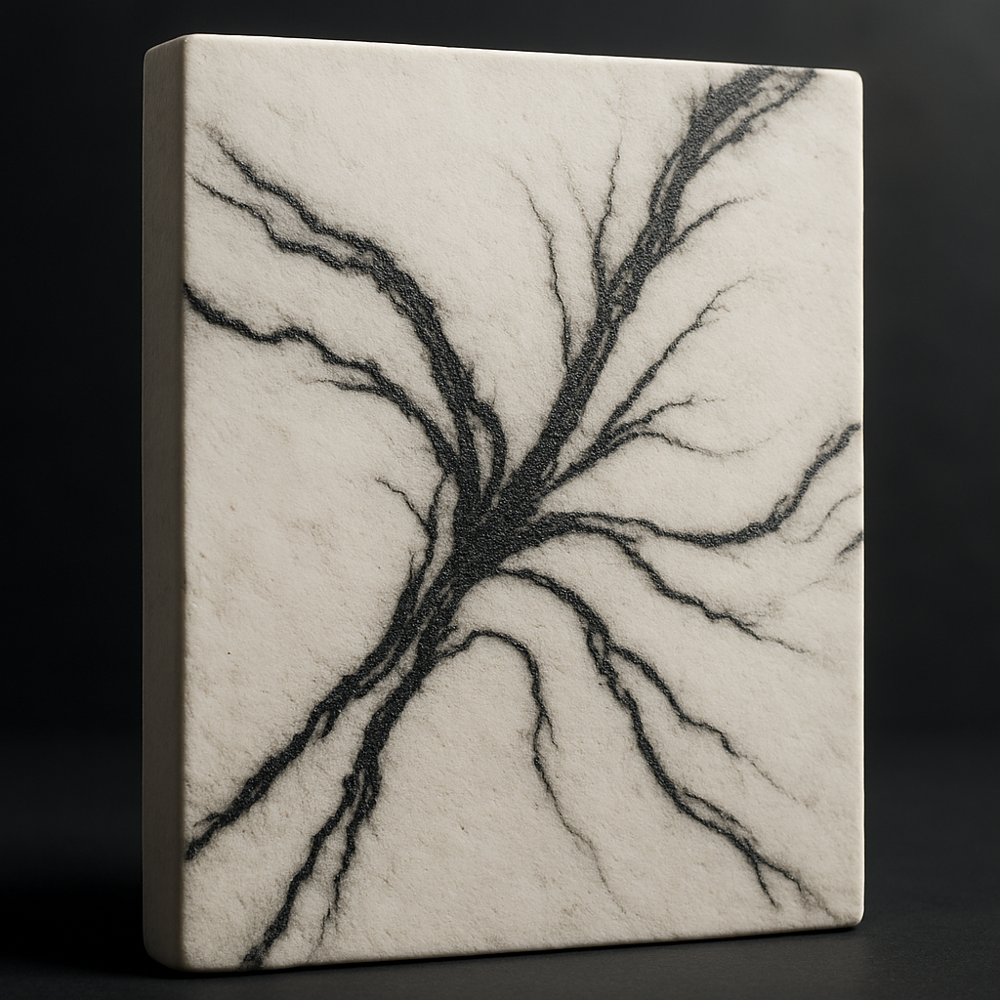
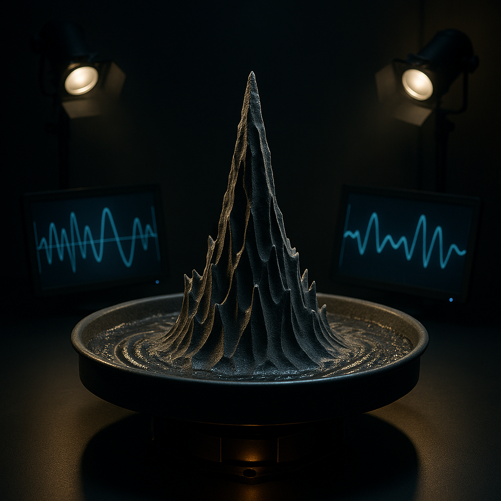
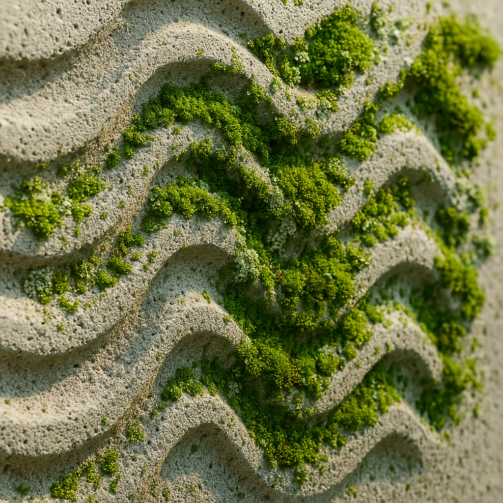
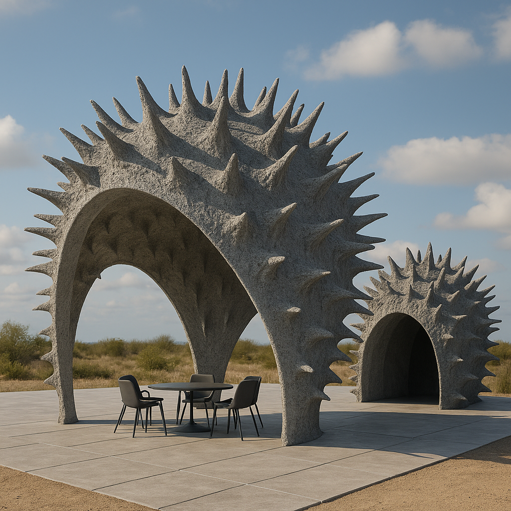

# Sonic Ferrocrete
### Sculpting cement with sound, magnetism, and open hardware

> **Quick start (5 min):** Print the tray in `hardware/`, then run **Mode A**: pour 5–8 mm Ultracal + Fe3O4 mix, sweep 70–200 Hz until steady cells appear, hold 6–10 min, cure, demold.

**Docs:** See `experiments/modeA_acoustic_patterning.md` and `experiments/modeB_magnetic_veining.md`  
**Contributing:** See `CONTRIBUTING.md` • **Citation:** `CITATION.cff`

Open, reproducible experiments in **magneto-acoustic forming** of gypsum/cement slurries (aka “sonic ferrocrete”).

**In plain language:** we’re playing with wet plaster and concrete mixes, shaking them with music-like tones, and nudging the iron particles inside with magnets. When the mix sets, you get ripples, veining, and textures that look like frozen sound waves or marble—no lab coat required. If this works at scale, it’s a proof that you can *shape cement with waves*, hinting at future building elements cast with built-in acoustics, drainage, or ornament baked in from the first pour.

## Bench Snapshot

*Silicone mold riding on a tactile transducer during a live tone sweep.*

## TL;DR

- **What:** Open hardware + material recipes for sculpting cementitious mixes with sound, magnets, and electromagnets.
- **Who:** Makers, architects, materials researchers, and curious experimenters who want repeatable bench protocols.
- **Why:** Freeze standing waves and magnetic veining into panels to explore new building skins, art pieces, and responsive surfaces.
- **How:** Print or CNC the tray, follow Mode A/B protocols, log results, and share back via the provided issue templates.

## Table of Contents

- [Bench Snapshot](#bench-snapshot)
- [What is this?](#what-is-this)
- [Getting Ready](#getting-ready)
- [Quick start](#quick-start)
- [Repo layout](#repo-layout)
- [First Milestone](#first-milestone)
- [Potential Applications](#potential-applications)
- [Safety](#safety)
- [Licensing](#licensing)
- [Contributing & Community](#contributing--community)

## What is this?

We embed magnetic particles (black iron oxide) in a fresh slurry and use **sound (standing waves)** and/or **magnetic fields** to organize surface topology and internal veining **before** the mix sets.

## Getting Ready

- Gear up with the [first-run shopping list](docs/SHOPPING_LIST.md) and optional [Amazon wishlist](https://www.amazon.com/hz/wishlist/ls/2M4MIQ3A0BSB9?ref_=wl_share).
- Review the full [experiment protocol & roadmap](docs/EXPERIMENT_PLAN.md) covering Modes A/B and future electromagnetic trials.
- Prep logging folders under `experiments/run_###/` so you’re ready to drop photos and CSVs immediately after a pour.

## Quick start

1. Print or fabricate the tray in `hardware/`.
2. Follow `experiments/modeA_acoustic_patterning.md` (sound) and `modeB_magnetic_veining.md` (magnets).
3. Spin up `experiments/run_log_template.csv`, open an [Experiment Run issue](https://github.com/samjhill/sonic-ferrocrete/issues/new?template=experiment_run.yml), and capture photos per `experiments/photography_guide.md`.

## Repo layout

- `hardware/` — OpenSCAD tray, magnet-sled notes, BOM
- `experiments/` — lab guides (Mode A/B), photo tips
- `data/` — CSV templates for frequency/depth/viscosity vs. pattern results
- `simulation/` — thin-film heightfield notebook for rapid concept tests (`thinfilm_heightfield.ipynb`, open in Jupyter/VS Code; Binder link planned)
- `scripts/` — utilities (e.g., pixel-measurement to wavelength)

## First Milestone

- [ ] Print 120×120 tray; seal corners.
- [ ] Water resonance dry-run (Hz vs. visible cell count).
- [ ] Mode A: 3 freqs × 2 depths → photos + CSV.
- [ ] Mode B: straight-line + spiral sled → photos.
- [ ] Short video; share repo link.

## Potential Applications

### Cymatic Architectural Facade
Frozen ripples create a sound-shaped facade module for large-scale installations.

*Concept render: acoustic standing waves cast into facade panels.*

### Magnetically Veined Plaster Panel
Magnetite veining suggests marble-like surfaces guided by field lines.

*Concept render: magnetite-rich veins emulate marble textures.*

### Sound-formed Sculpture
Mid-resonance waves solidify into sculptural geometry—dynamic motion caught in time.

*Concept render: resonant ridges captured mid-pour.*

### Bio-reactive Concrete Facade
Porous, patterned surfaces encourage moss and lichen colonization while managing moisture.

*Concept render: sound-shaped cavities support moss/lichen growth.*

### Pavilion Formed by Sound
Large-scale intervention shaped by resonance patterns for immersive environments.

*Concept render: pavilion surfaces derived from sonic interference.*

## Safety

- Wear hearing protection when running prolonged tone sweeps.
- Use N95/P100 masks and gloves while handling cement, iron oxide, or sand.
- Keep strong magnets away from electronics, cards, and pinch points.
- Follow the detailed cautions in the experiment docs before mixing or casting.

## Licensing

- Code, CAD, and scripts: [MIT License](LICENSE)
- Media (photos/figures/renders): [CC BY 4.0](https://creativecommons.org/licenses/by/4.0/) — attribute “Sonic Ferrocrete / Sam Hill”

## Contributing & Community

- Start with the [CONTRIBUTING guide](CONTRIBUTING.md) and the [Code of Conduct](CODE_OF_CONDUCT.md).
- Log each pour with the [Experiment Run issue template](https://github.com/samjhill/sonic-ferrocrete/issues/new?template=experiment_run.yml) and attach data/photos in `experiments/run_###/`.
- Share tweaks to `hardware/*.scad` with screenshots or STL artifacts; the CI workflow auto-exports tray/sled STLs on PRs.
- Discuss ideas, request features, or ask questions by opening an issue labeled `question` or `planning`.
